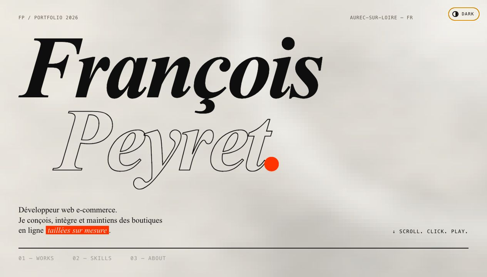

# Portfolio 2026

Portfolio personnel de François Peyret, développé avec Astro.

Le site présente une sélection de projets e-commerce, les compétences techniques principales, ainsi qu'une section contact. Il est généré en statique dans le dossier `docs` afin d'être publié directement avec GitHub Pages.

## Dépendances

- Astro 5
- Node.js et npm

## Scripts

```bash
npm run dev
npm run build
npm run preview
```

Le build de production est généré dans `docs/` avec le préfixe GitHub Pages `/portfolio-2026/`.

## Publication

URL cible : `https://francoispeyret.github.io/portfolio-2026/`

Dans GitHub Pages, utiliser la branche principale et le dossier `/docs`.
